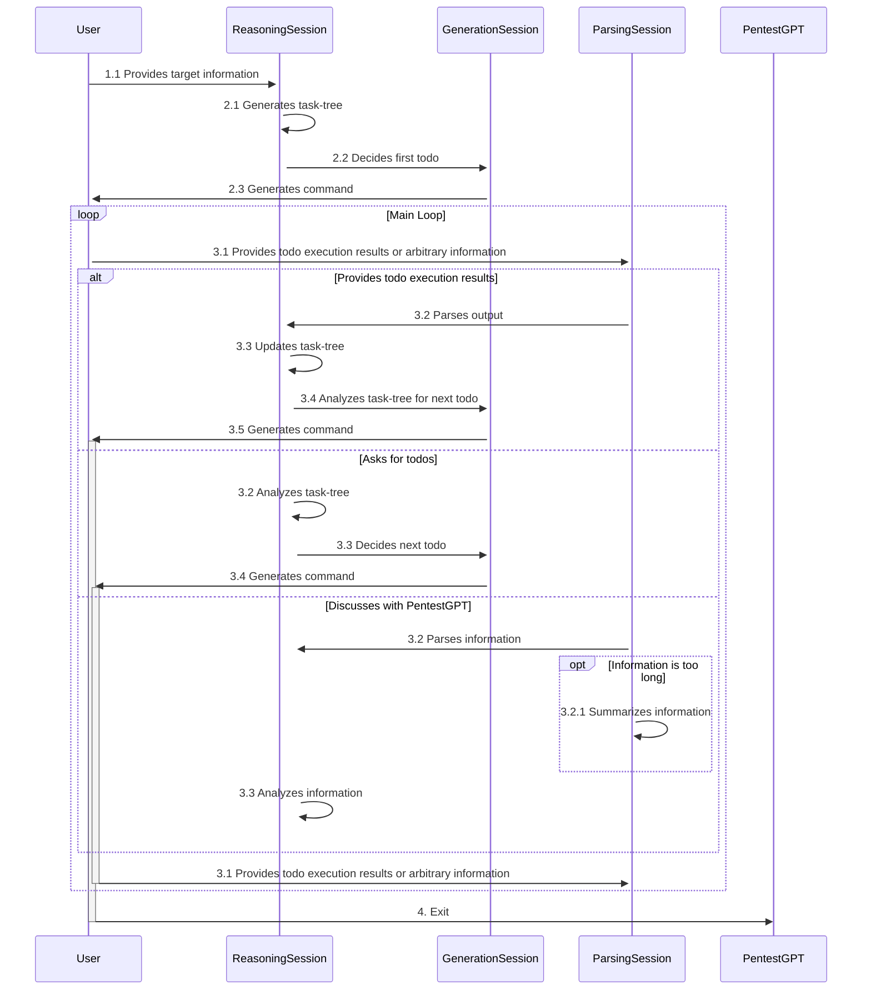

## Design Documentation for PentestGPT
The current design is mainly for web penetration testing

### General Design
PentestGPT provides a unified terminal input handler, and backed by three main components:
- A test generation module which generates the exact penetration testing commands or operations for the users to execute.
- A test reasoning module which conducts the reasoning of the test, guiding the penetration testers on what to do next.
- A parsing module which parses the output of the penetration tools and the contents on the webUI.

### Function Design
The handler is the main entry point of the penetration testing tool. It allows pentesters to perform the following operations:
1. (initialize itself with some pre-designed prompts.)
2. Start a new penetration testing session by providing the target information.
3. Ask for todo-list, and acquire the next step to perform.
4. After completing the operation, pass the information to PentestGPT.
   1. Pass a tool output.
   2. Pass a webpage content.
   3. Pass a human description.
5. The generation module can also start a continuous mode, which helps the user to dig into a specific task.

#### Logic Flow Design
1. User initializes all the sessions. (**prompt**)
2. User initializes the task by
   1. **User** provides the target information to the **ReasoningSession**. 
   2. The **ReasoningSession** generates a *task-tree* based on the target information. 
   3. The **ReasoningSession** decides the first todo, and passes the information to the **GenerationSession**. 
   4. The **GenerationSession** generates the exact command for the user to execute, and passes it to the **User**. 
3. Go into the main loop. The **User** can pick to:
   1. Provide todo execution results to PentestGPT.
      1. The **User** provides the output of the tool to the **ParsingSession**. 
      2. The **ParsingSession** parses the output, and passes the information to the **ReasoningSession**.
      3. The **ReasoningSession** updates the *task-tree* based on the information.
      4. Do step 3.2.1-3.2.3
   2. Ask for todos.
      1. The **ReasoningSession** analyzes the *task-tree*. It decides the next todo, including (1) a natural language description, and (2) the exact command to execute.
      2. The **ReasoningSession** passes the information to the **GenerationSession** for further verification.
      3. The **GenerationSession** generates the exact command for the user to execute, and passes it to the **User**.
   3. Discuss with PentestGPT by providing arbitrary information.
      1. The **User** provides the information to the **ParsingSession**.
      2. The **ParsingSession** parses the information:
         - If it is too long, summarize it.
         - Otherwise, just rephrase it.
      3. The **ReasoningSession** analyzes the information, and updates the *task-tree*.

   - Exit the program.

A flow-chart is shown below:

#### Prompts
The prompts are stored in the `prompts/prompt_class.py`. 

