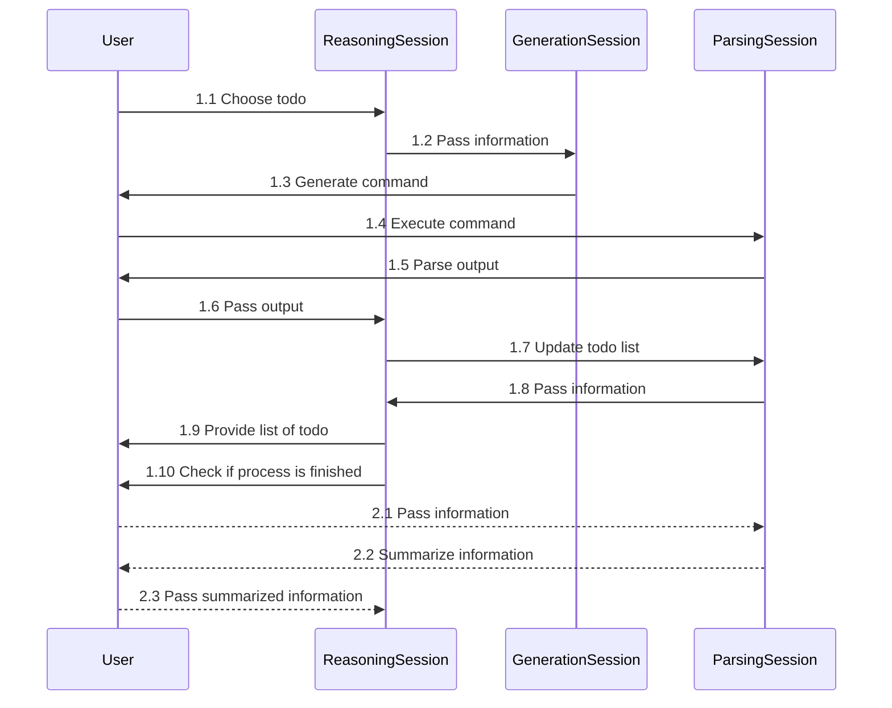

# PentestGPT

## Introduction
**PentestGPT** is a penetration testing tool empowered by **ChatGPT**. It is designed to automate the penetration testing process. It is built on top of ChatGPT and operate in an interactive mode to guide penetration testers in both overall progress and specific operations.

## Contribute
The project is still in its early stage. Feel free to raise any issues when using the tool. 

## Installation
1. Install `requirements.txt` with `pip install -r requirements.txt`
2. Install `chatgpt-wrapper` if you're non-plus members: `pip install git+https://github.com/mmabrouk/chatgpt-wrapper`. More details at: https://github.com/mmabrouk/chatgpt-wrapper. Note that the support for non-plus members are not optimized.

## Examples
1. To start, run `python3 main.py`. 

## Development
- [ ] Add chunk processing
- [ ] Add prompt optimization
- [ ] Test scenarios beyond web testing

## Design Documentation
The current design is mainly for web penetration testing

### General Design
PentestGPT provides a unified terminal input handler, and backed by three main components:
- A test generation module which generates the exact penetration testing commands or operations for the users to execute.
- A test reasoning module which conducts the reasoning of the test, guiding the penetration testers on what to do next.
- A parsing module which parses the output of the penetration tools and the contents on the webUI.

### Function Design
The handler is the main entry point of the penetration testing tool. It allows pentesters to perform the following operations:
1. (initialize itself with some pre-designed prompts.)
2. Start a new penetration testing session by providing the target information.
3. Ask for todo-list, and acquire the next step to perform.
4. After completing the operation, pass the information to PentestGPT.
   1. Pass a tool output.
   2. Pass a webpage content.
   3. Pass a human description.

### System Design
#### General Structure
1. Maintain three chat sessions in one class. Each session is for one component.
2. User can select to pass information to one section. In particular.
   1. todo.
   2. pass information.

#### Logic Flow Design
1. User initializes all the sessions.
2. User follows the instruction to perform penetration testing in the following logic.
   1. Reasoning session provides a list of todo for user to choose from.
   2. User chooses one todo, and reasoning session passes the information to generation session.
   3. Generation session generates the exact command for the user to execute.
   4. User executes the command, and passes the output to the parsing session.
   5. Parsing session parses the output, and passes the information to reasoning session.
   6. Reasoning session updates the todo list, and provides the next todo for the user to choose from.
3. User can also pass information to the reasoning session directly.
   1. User passes the information to parser session.
   2. Parser session summarizes the information, and passes the information to the reasoning section.

A flow-chart is shown below:

#### Wrapper Design

#### Session Design

